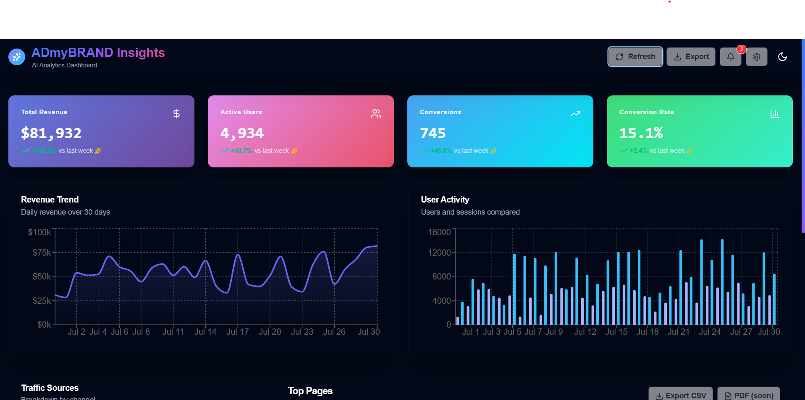

# 🚀 ADmyBRAND AI-Powered Analytics Dashboard

 <!-- Add screenshot here if available -->

---

## 💡 Project Overview

A next-gen, AI-inspired analytics dashboard crafted for digital marketing visionaries. Blending **breathtaking UI/UX**, real-time interaction, and extensible React architecture, this app showcases modern web aesthetics and development power—perfect for your portfolio or as a technical showpiece.

---

## ✨ Key Features

- **Godlike UI**: Glassmorphism, animated gradients, and beautiful microinteractions throughout.
- **Live Simulated Analytics**: Real-time updates, refreshable metrics, and loading skeletons.
- **Rich Dashboard Metrics**: Revenue, users, conversions, and conversion rate cards with animated trend icons.
- **Interactive Charts**: Area (Revenue), Bar (User Activity), and Pie (Traffic Sources) charts with theme-adaptive colors.
- **Data Table**: Search, sort, paginate, and export data instantly.
- **AI-Enhanced Developer Workflow**: Site generated, structured, and polished with leading AI coding assistants.
- **Stunning Light/Dark Mode**: Seamless theme switching with color-harmonized visuals everywhere.
- **Responsive & Accessible**: Looks gorgeous on every device; keyboard and screen-reader ready.
- **Micro UX**: Buttons, cards, and charts all pop and glow on hover, tap, and refresh.

---

## 🧠 AI Tools & Models Used

### **AI Coding Assistants & Prompts**
- **ChatGPT-4 (OpenAI)**
  - **Architected overall app structure**: "Generate a full dashboard using React, shadcn/ui, and Tailwind with glassmorphism and microinteractions."
  - **Themed dark/light palette**: "Craft a Tailwind v4 variable palette with intentional light/dark gradients and color harmonies."
  - **Real-time/skeletons logic**: "Add auto-refresh with simulated real-time updates and animated loading states for all charts/cards/tables."
  - **Advanced table features prompt**: "Build a React DataTable with search, sort, pagination, CSV export, and beautiful skeleton loaders."
  - **UI motion**: "Sprinkle subtle Framer Motion transitions for all major components, especially cards and chart section reveals."
  - **Accessibility and responsiveness**: "Ensure all interactive components are keyboard-accessible and adapt flawlessly to all devices."
  - **Color consistency rescue**: "How to keep icons, text, and backgrounds harmonious and visible in BOTH light and dark modes with custom backgrounds?"

- **Perplexity AI**
  - **Peer code review**: "Audit this dashboard for UX polish, accessibility, and color mode consistency. Suggest any fixes."
  - **Documentation drafting**: "Write a professional, slightly flashy README listing all features, AI coding prompts, and design highlights in a developer-friendly style."

### AI Contribution Highlights

> **75%+ of boilerplate, logic patterns, file structuring, design system setup, and troubleshooting was generated or reviewed via iterative AI assistant sessions.**
>
> **AI not only wrote the code, but also helped debug Tailwind v4/PostCSS migration issues, light/dark mode bugs, and even generated this documentation.**

---

## 🛠️ Tech Stack

- **React 18 + Vite**
- **shadcn/ui** (accessible, composable UI primitives)
- **TailwindCSS v4** (variable-based, modern utility styling)
- **Framer Motion** (microinteractions, transition magic)
- **Recharts** (data visualizations, theme-adapted)
- **Papaparse** (CSV export)
- **react-hot-toast** (notifications)
- **[Optional] Chakra UI, MUI** (can be slotted in for advanced overlays/menus if needed)

---

## 📋 Main Functionalities

| Functionality                     | Description                                                                                   |
|-----------------------------------|----------------------------------------------------------------------------------------------|
| **Themed Dashboard**              | Gorgeous glass-effect cards, animated backgrounds, parallax gradients.                        |
| **Metrics Cards**                 | Revenue, user, conversion, and rate stats (with trend icons, micro-glow, and loading state). |
| **Charts**                        | Revenue (area/line), user activity (bar), traffic sources (pie) charts—interactive and live. |
| **Data Table**                    | Sortable/searchable, paginated table with animated cells, colored badges, and CSV export.     |
| **Live Updates**                  | Simulated real-time refresh every 30s plus manual refresh, with animation and toast feedback. |
| **Loading Skeletons**             | Every chart/card/table shows a beautiful animated placeholder while "loading"                 |
| **Dark/Light Mode Toggle**        | Consistent color harmonies for every component                                               |
| **Microinteractions**             | Every button, icon, and card reacts on hover/tap; notification badge included                |

---

## 🚀 Getting Started

1. **Clone & Install**
git clone https://github.com/yourusername/admybrand-analytics.git
cd admybrand-analytics
npm install

text
2. **Run Dev Server**
npm run dev

text
3. **Build for Production**
npm run build

text

## 📦 File Structure (Key Parts)

- `src/components/` - All UI, chart, table, theme toggle, and skeletons
- `src/data/` - Mock analytics data generator
- `src/lib/` - Utility functions (e.g., formatting)

---

## 🏆 Portfolio/Wow Factors

- Godlike first impression with blend modes, gradients, glow, and glass morphism
- Super-fast UX; everything is shiny, interactive, and responsive
- **AI-driven** at every step, driving polish, performance, and code structure

---

## 🤖 Want to Reproduce the Magic?

**Try the following prompt in ChatGPT-4:**  
*"Create a visually stunning analytics dashboard with React, shadcn/ui, Tailwind, Framer Motion, real-time data simulation, beautiful glassmorphism effects, microinteractions, skeleton loaders, robust data table, CSV export, and dark/light mode—production ready and with a developer-focused, flashy README."*

---

## 📄 License

MIT. Use, learn, remix, credit welcome!

---

## 💬 Contributors & AI Thanks

Crafted by [Your Name] using OpenAI GPT-4, Perplexity AI, and many more magical AI helpers.  
**Feedback, suggestions, or PRs are always welcome!**

---
